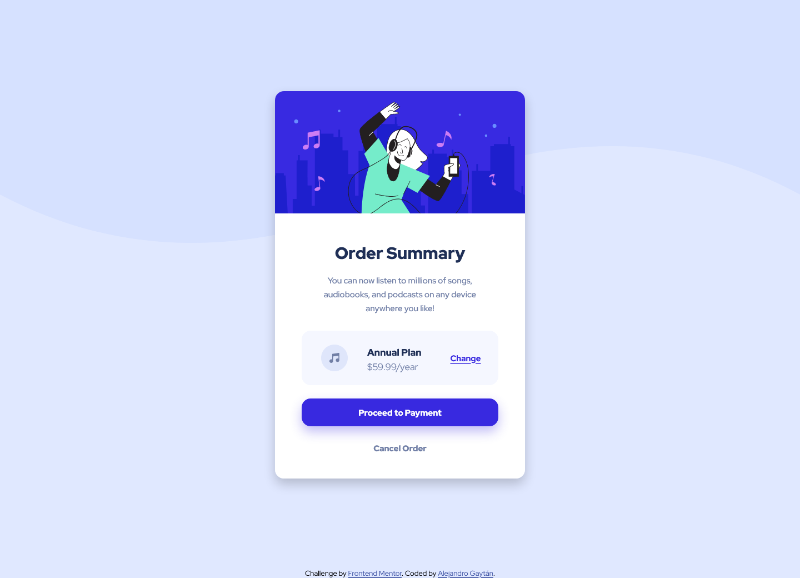
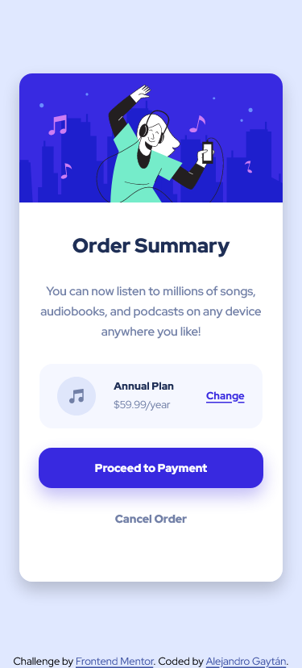

# Frontend Mentor - Order summary card solution

This is a solution to the [Order summary card challenge on Frontend Mentor](https://www.frontendmentor.io/challenges/order-summary-component-QlPmajDUj).

## Table of contents

- [Overview](#overview)
  - [The challenge](#the-challenge)
  - [Screenshot](#screenshot)
  - [Links](#links)
- [My process](#my-process)
  - [Built with](#built-with)
  - [What I learned](#what-i-learned)
  - [Continued development](#continued-development)
  - [Useful resources](#useful-resources)
- [Author](#author)

## Overview

### The challenge

Users should be able to:

- See hover states for interactive elements
- View the optimal layout for the section depending on their device's screen size

### Screenshot

<div align="center">

  

  

</div>

### Links

- Solution URL: [Solution URL here](https://github.com/GGA-Alex/Order-Summary-Component)
- Live Site URL: [Live site URL here](https://reverent-leavitt-52c7e1.netlify.app/)

## My process

### Built with

- Semantic HTML5 markup
- CSS custom properties
- Flexbox
- CSS Grid
- Media queries
- Mobile-first workflow
- [Styled Components](style-guide.md)

### Continued development

- CSS Grid
- Media queries
- Mobile-first workflow

### What I learned

```css
.payment-btn {
    box-shadow: 0rem 1rem 2rem rgba(56, 41, 224, .3);
}

```

### Useful resources

- [Grid in CSS](https://developer.mozilla.org/en-US/docs/Web/CSS/grid) - This article helped me to understand the grid in CSS.
- [@media](https://developer.mozilla.org/en-US/docs/Web/CSS/@media) - This article helped me to understand media queries in CSS.
- [Flexbox](https://developer.mozilla.org/en-US/docs/Learn/CSS/CSS_layout/Flexbox) - This article helped me to understand flexbox.
- [Box-shadow](https://developer.mozilla.org/en-US/docs/Web/CSS/box-shadow) - This article helped me to understand how to use box-shadow in css.

## Author

- Github - [Alejandro Gaytan](https://github.com/GGA-Alex)
- Frontend Mentor - [@GGA-Alex](https://www.frontendmentor.io/profile/GGA-Alex)
- Twitter - [@Alejandro_AGG07](https://twitter.com/Alejandro_AGG07)
